# The `oomph-lib` GitHub workflow

This document is intended as a guide to working with and contributing to the (now-GitHub-hosted) `oomph-lib` repository. It is **not** intended to be a comprehensive guide to Git/GitHub itself, though we aim to be comprehensive in the sense that we show you all the steps required to interact with the repository. In this sense no prior knowledge of Git/GitHub is required. For more information on Git/GitHub, we recommend the excellent Git Book which is available at https://git-scm.com/book/en/v2

_Notation:_ We prefix any command line input with "`>>>`" and generally show the resulting output from Git underneath. Lengthy output is sometimes truncated and omitted parts are then indicated by "`[...]`". Comments for specific commands are prefixed with "`#`".

## Table of contents

  - [Basic setup (only to be done once)](#basic-setup-only-to-be-done-once)
  - [The workflow](#the-workflow)
  - [The steps in detail](#the-steps-in-detail)
  - [Testing the documentation](#testing-the-documentation)
    - [Initial setup (only to be done once)](#initial-setup-only-to-be-done-once)
    - [Initiating the (re-)build of the webpages](#initiating-the-re-build-of-the-webpages)
  - [Code review](#code-review) 
  - [Advanced: pulling in upstream changes from the command-line](#advanced-pulling-in-upstream-changes-from-the-command-line)

  - [Clang-format](#clang-format)
  - [Pre-commit hooks (optional)](#pre-commit-hooks-optional)
    - [Installing](#installing)
    - [Uninstalling](#uninstalling)
    - [Remarks](#remarks)

## Basic setup (only to be done once)

We assume that you have created a GitHub account, and for the purpose of this document assume that your GitHub home page is https://github.com/JoeCoolDummy. Unless your name is Joe Cool Dummy, you'll have to change the name to your own. (Some screenshots show the name of the actual people who prepared the associated parts of this document; too much work to edit the figures!)

Contributing to `oomph-lib` involves three separate repositories:
-   The official repository, https://github.com/oomph-lib/oomph-lib.

    This is a remote repository, hosted on GitHub. In Git terminology this repository is known as `upstream`.

-   Your remote forked version of the official repository, https://github.com/JoeCoolDummy/oomph-lib.

    This is a remote repository, hosted on GitHub. In Git terminology this repository is known as `origin` because it is the repository that you clone (as described in the next step) onto your local computer. You create the remote forked repository by going to the GitHub page for the official repository, https://github.com/oomph-lib/oomph-lib, and clicking on the fork button in the top right corner of that page.

    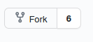

    Pressing that button will create a deep copy of the repository in your own account.

    Make sure you enable the Actions. These ensure that, once you have committed any changes to your remote forked repository, the self-tests are run automatically on a variety of operating systems. These tests must pass before you can issue a pull request to merge your changes into the official repository. By default the Actions are disabled, so click on the Actions button

    

    and enable the workflows:

    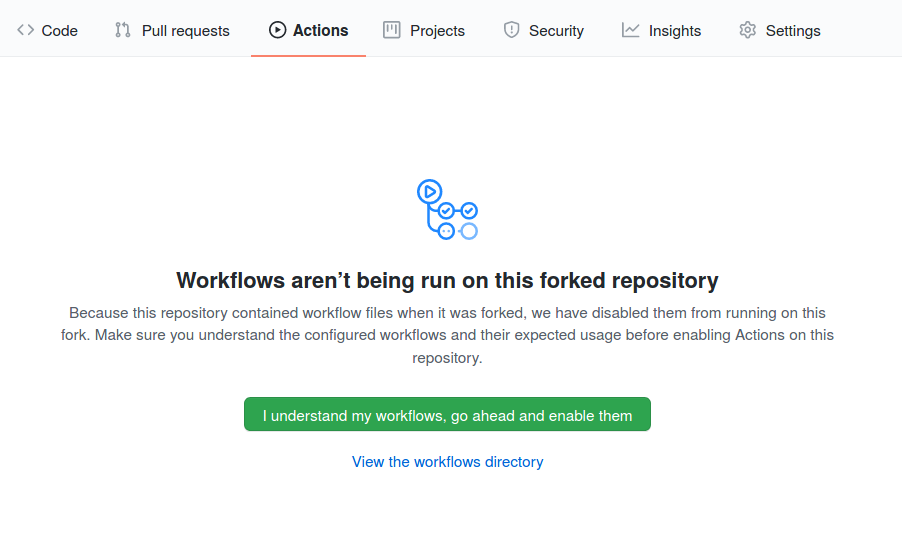


-   The cloned repository on your computer (obtained by cloning your forked repository).

    This repository is local to your computer and is cloned from your remote forked repository. It is where you do all your work before ultimately committing it, via the procedure described below, to the GitHub-hosted remote repositories.

    You create this repository from the command line on your computer, using
    ```bash
    >>> git clone git@github.com:JoeCoolDummy/oomph-lib.git
    ```
    This command will create a new directory, `oomph-lib` which contains all the code and the relevant Git information.

    If you haven't connected to GitHub via SSH before, you might encounter the following error:
    ```bash
    Cloning into 'oomph-lib'...
    git@github.com: Permission denied (publickey).
    fatal: Could not read from remote repository.

    Please make sure you have the correct access rights
    and the repository exists.
    ```
    To address this issue complete the following steps (links to the relevant GitHub resources have been provided):
    1. [Generate a new SSH key if you don't have one.](https://docs.github.com/en/github/authenticating-to-github/connecting-to-github-with-ssh/generating-a-new-ssh-key-and-adding-it-to-the-ssh-agent#generating-a-new-ssh-key)
    2. [Add the new SSH key to the ssh-agent.](https://docs.github.com/en/github/authenticating-to-github/connecting-to-github-with-ssh/generating-a-new-ssh-key-and-adding-it-to-the-ssh-agent#adding-your-ssh-key-to-the-ssh-agent)
    3. [Add the new SSH key to your GitHub account.](https://docs.github.com/en/github/authenticating-to-github/connecting-to-github-with-ssh/adding-a-new-ssh-key-to-your-github-account)

    More details, if required, can be found on [Connecting to GitHub with SSH](https://docs.github.com/en/github/authenticating-to-github/connecting-to-github-with-ssh).


    For consistency, we will use SSH commands in this document wherever possible.
    If you would prefer to use the HTTPS-based equivalents instead, replace all occurrences of
    ```bash
    git@github.com:JoeCoolDummy/oomph-lib.git
    ```
    with
    ```bash
    https://github.com/JoeCoolDummy/oomph-lib
    ```
    **NOTE:** It used to be possible to interact with GitHub via an alternative, HTTPS-based protocol that required you to provide a username and a password. [Password-based authentication has now been deprecated by GitHub, and replaced by "token-based authentication"](https://github.blog/2020-12-15-token-authentication-requirements-for-git-operations/). Therefore, if you wish to (continue to) operate in this mode you will need to generate your own PAT. Instructions on how to do this can be found on [Creating a personal access token](https://docs.github.com/en/github/authenticating-to-github/keeping-your-account-and-data-secure/creating-a-personal-access-token).

    Once cloning is complete, have a look around:
    ```bash
    >>> cd oomph-lib
    >>> ls -l
    ```

The official (`upstream`) repository has two key branches: `main` and `development`. These have now made it onto your computer. You can list the local branches as follows:
```bash
>>> git branch
  development
  main
```
If the `development` branch is not listed when running `git branch`, you can switch to it by using:
```bash
>>> git checkout development
Branch 'development' set up to track remote branch 'development' from 'origin'.
Switched to a new branch 'development'
```
You should only ever interact with the `development` branch. The `main` branch is only updated (and never by you!) when a new stable version with significant new features is available and needs to be shared with the whole wide world.

## The workflow
We will assume that you have updated your remote forked repository from the official one, and have updated the `development` branch on your computer before doing any new
work. (We show below how this is done as part of the overall workflow but want
to make sure we know where to start; if you have just completed the steps described in 'Basic setup' above, you are now in this blissful state).

The end-goal is to emulate the Git branching model described
in [A successful Git branching model](https://nvie.com/posts/a-successful-git-branching-model).

The idea is as follows: you add your changes to your *local forked forked*
repository, and then push these changes to your *remote forked* repository. Once
you are happy to share your additions with the *upstream* repository, you can
create a contribution via a mechanism called a "pull request", from your *remote forked repository* on GitHub.

This involves the following steps:

1. Create a new branch on your computer.
2. Do some work and add/commit it on your computer (i.e. locally).
3. Check it.
4. Check it again.
5. Push the changes from your local forked repository (the one on your computer) to your remote forked repository (on GitHub).
6. Wait for the automated self-tests to pass (check the Actions tab of your remote forked repository on GitHub for progress updates and log files). If they don't, resolve the issues and repeat from step 2.
7. Create a pull request to merge the changes created in that branch into the `development` branch of the official (`oomph-lib/oomph-lib`) repository (`upstream`).
8. Once the pull request has been accepted (and your changes have thus been merged into the official repository), update your remote forked repository (`origin`) on GitHub.
9. Update the `development` branch on your computer from your remote forked repository (`origin`).

## The steps in detail


1. Start from the branch you want to work on, e.g. `development`
   ```bash
   >>> git checkout development
   Switched to branch 'development'
   Your branch is up-to-date with 'origin/development'.
   ```
   and check that everything is clean:
   ```bash
   >>> git status
   On branch development
   Your branch is up to date with 'origin/development'.

   nothing to commit, working tree clean
   ```


2. Make a new branch to do some work (here `feature-add-new-important-headers`) and switch to it at the same time:
   ```bash
   >>> git checkout -b feature-add-new-important-headers
   Switched to a new branch 'feature-add-new-important-headers'
   ```
   (This combines the two separate commands `git branch feature-add-new-important-headers` and `git checkout feature-add-new-important-headers`.)

   **Note:** it is important that you do **not** adopt the convention of placing "/" in a branch name (e.g. `feature/add-new-important-headers`), as it will break the relative links used in the main `README.md`; you should try to use hyphens only. There's also no need to prefix the branch with "feature", though this is common practice.

   Now check (if you don't believe it) that you're really on the new branch:
   ```bash
   >>> git status
   On branch feature-add-new-important-headers
   nothing to commit, working tree clean
   ```

3. Now do some work and add the files you wish to keep (i.e. stage them for the next commit):
   ```bash
   # ...do some work...

   >>> git status
   On branch feature-add-new-important-headers
   Untracked files:
   (use "git add <file>..." to include in what will be committed)
         new-file1.h
         new-file2.h
         new-file3.h
         new-file4.h

   nothing added to commit but untracked files present (use "git add" to track)

   # Don't want to add new-file3.h and new-file4.h, so only add the others
   >>> git add new-file1.h new-file2.h

   >>> git status
   On branch feature-add-new-important-headers
   Changes to be committed:
   (use "git restore --staged <file>..." to unstage)
         new file:   new-file1.h
         new file:   new-file2.h

   Untracked files:
   (use "git add <file>..." to include in what will be committed)
         new-file3.h
         new-file4.h
   ```
   (Note: If you only want to add files that were changed and that are
   already under Git version control, you can use `git add -u`; this command will not add any newly created files.)
 
   (Second Note: As soon as you have staged any files then `git diff` will no longer show any differences between them and the current versions in the repository.)


    ```bash
    # Accidentally added a file or changed your mind and want to remove new-file2.h
    >>> git reset new-file2.h
    ```
    or

    ```bash
    >>> git restore --staged new-file2.h
    ```

    ```
    >>> git status
    On branch feature-add-new-important-headers
    Changes to be committed:
    (use "git restore --staged <file>..." to unstage)
          new file:   new-file1.h

   Untracked files:
   (use "git add <file>..." to include in what will be committed)
         new-file2.h
         new-file3.h
         new-file4.h 
   ```

4. Now commit. A one-line commit message can be provided from the command line.
   The first 50 characters should be self-contained and written in "imperative"
   voice (i.e. "Update .clang-format" rather than "Updated .clang-format"). If
   no message is specified on the command line (with the `-m` flag), an editor
   will open a file for a possibly longer commit message (to which the same rules
   apply; specifically the first line should be no longer than 50 characters and
   be self-contained). You can (and in fact are encouraged to) format any longer
   messages nicely using Markdown; see
   https://github.com/adam-p/markdown-here/wiki/Markdown-Cheatsheet.
   ```bash
   >>> git commit -m "Add new-file1.h and new-file2.h to repository."
   [feature-add-new-important-headers 688ef2cfe8] Add new-file1.h and new-file2.h to repository.
   2 files changed, 0 insertions(+), 0 deletions(-)
   create mode 100644 new-file1.h
   create mode 100644 new-file2.h
   ```
   **IMPORTANT:**
   You can switch between branches at any point (e.g. `git checkout main` will get you onto the `main` branch
   in your local repository) but if you have not committed your work, the changes will automatically be moved across to the
   branch you are switching to. This is unlikely to be the desired outcome as we are specifically working on a separate
   branch to keep our new work isolated from the rest of the code. If you accidentally ended up moving changed files onto another branch
   you can simply switch back to the branch you were just on (i.e. do  `git checkout feature-add-new-important-headers`) and commit your changes there.
   When you then switch back to the `main` branch, these changes will no longer follow you.

   If your work is not quite ready to be committed, you can save your changes for later by first running
   ```bash
   >>> git stash
   ```
   and, once you have returned to the branch upon which you made changes, running
   ```bash
   >>> git stash apply
   ```
   to restore them; see `git help stash` for more detail

5. Now push the commit to your (GitHub-hosted) remote forked repository (`origin`).

   The first time you do this you have to this explicitly state that you want the branch to be added to the `origin` repository, using the `--set-upstream` flag (which can be abbreviated to `-u`)
   ```bash
   >>> git push --set-upstream origin feature-add-new-important-headers
   ```

   Subsequent pushes will no longer require the `--set-upstream` flag, so you can just do
   ```bash
   >>> git push origin feature-add-new-important-headers
   ```

   **IMPORTANT:** During subsequent pushes you may encounter an error from GitHub
   telling you that your push request was rejected because a file that you want to push
   was changed in the remote forked repository. This may come as a surprise since you're
   (typically) the only person working with this repository and you'd surely remember if you'd
   pushed any changes in between, so you're not expecting any conflicts. If so, this is almost
   certainly because of the automatic code formatting we use (see
   [Clang-format](#clang-format)). Once you push a file to the remote repository it is
   automatically formatted, and if this produces any changes they are then committed
   automatically, meaning that the remote forked repository is "ahead" of your local cloned
   version. Running
   ```bash
   >>> git pull origin feature-add-new-important-headers
   ```
   will pull these formatting changes back into your local repository. To avoid merge conflicts
   it's a good habit to do this a few minutes after pushing anything to your remote repository.

   Also remember that a push to a remote repository will usually spawn a number of Action-based self-tests. While these don't "cost" us anything (Thank you, GitHub!) you should still kill unnecessary runs (in the Actions tab) if the push to your forked repository is intended as a backup and/or has not affected parts of the library that are tested by these Actions. For instance, there's no need to re-run the self-tests if you've only worked on the documentation. You can cancel a particular workflow by clicking on the "..." button as shown here:

    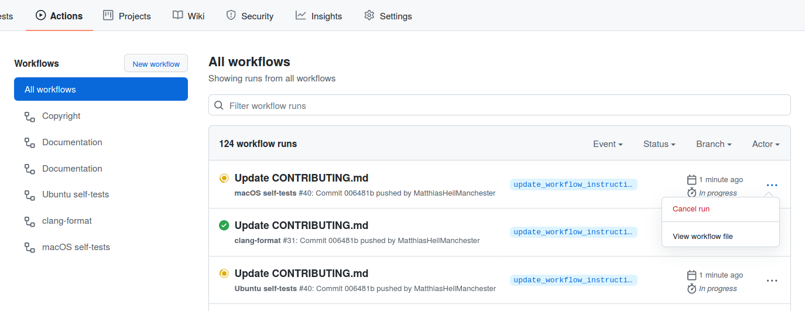

    However, a complete set of self-tests should be run before submitting a pull request.


6. Now go to the GitHub webpage for your remote forked repository
   (https://github.com/JoeCoolDummy/oomph-lib/) and click on the button with a branch symbol and the text "`main`":

    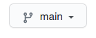

    then click on the `feature-add-new-important-headers` branch in the drop-down menu that appears. When you reach the new page, click the green "Compare & pull request" button.

    

     Carefully check all changes (shown at the bottom of the page) and select reviewers, using the button on the right hand side of the screen.

    

    Also choose one or more label(s) from the dropdown menu to indicate which part of the library is affected by your pull request.

      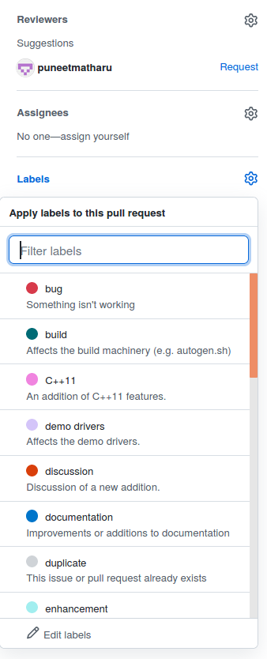

   By default, the pull request will attempt to merge into the `main` branch of
   the base repository (`oomph-lib/oomph-lib`) as indicated in this box:

   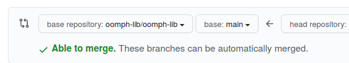

   Since commits must only be made to the `development` branch, not the `main` branch, click the "`base: main`" button and click "`development`" from the dropdown menu:

   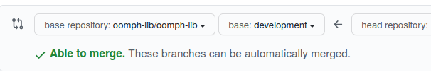

   Provide a meaningful description of your changes in the textbox, press the button "Create pull request" and wait for somebody to merge your changes in (or get back to you with comments/requests; see below in [Code review](#code-review) for details of the review process). Note that subsequent changes (in response to discussions/requests, say) can simply be submitted to the same branch (repeating everything from step 3 above); they will automatically be added/included to the same pull request.

   Note that when you return to the branch's GitHub page (on your remote forked repository) you won't see the lovely green

   

   button any more (presumably because a pull request is already pending). To add the newly made changes to the existing pull request, click on the "Contribute" button, next to the "Fetch upstream" one

   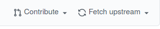

   and continue from there. Leave another comment to explain the changes you've made in response to the reviewer's comments/requests (again, see the instructions for the [Code review](#code-review) for details), and then fingers crossed!

7. Once the pull request has been accepted and the changes made have been merged
   into the official repository, update the `development` branch on your remote forked branch. This is done most easily via the webpage: go to the `development` branch for the remote forked repository, i.e. go to https://github.com/JoeCoolDummy/oomph-lib and click on the button with a branch symbol and the text "`main`":

    

    Select the `development` branch from the dropdown menu.
     GitHub will show you that "This branch is n commits behind `oomph-lib:development`."
     The "Fetch upstream" button allows a comparison ("Compare") and "Fetch and merge". Go for the latter when happy. GitHub will now announce that "This branch is even with `oomph-lib:development`".

   **Note: It is a good idea to do this regularly to make sure that you have the latest changes.**

8. Now the `development` branch on your computer (cloned from the forked
   remote repository) is out of sync with the updated version at GitHub. (And if you do `git difftool feature-add-new-important-headers..development` you'll see that the `development` branch obviously(!) does not yet contain the changes we've made in the local forked `feature-add-new-important-headers` branch.) So pull the updated
   `development` branch from the `origin` repository, as follows:

   First go back to `development` branch (assuming we're still on the
   `feature-add-new-important-headers` one)

   ```bash
   >>> git checkout development
   ```

   Now `git pull` (= `git fetch` + `git merge`) the changes from the
   `development` branch in the remote forked repository (`origin`):

   ```bash
   >>> git pull origin development
   ```

   Assuming this pull doesn't conflict with any other changes made to your
   `development` branch, the local forked `development` and
   `feature-add-new-important-headers` branches should now agree. Check by
   running

   ```bash
   >>> git diff feature-add-new-important-headers..development
   ```

   The above command should not produce an output. We can then get rid of the branch on which we did the work, both locally,

   ```bash
   >>> git branch -d feature-add-new-important-headers
   ```

   and remotely on the remote forked repository (`origin`),

   ```bash
   >>> git push origin --delete feature-add-new-important-headers
   ```
## Testing the documentation

`oomph-lib`'s extensive documentation is generated by [Doxygen](https://www.doxygen.nl/index.html) and the full set of webpages (containing many detailed tutorials) is hosted on GitHub. The webpages are regenerated automatically whenever the `main` branch of the official `oomph-lib` repository is updated. It is therefore important that you check any changes to the documentation and make sure that they render correctly before they are ultimately committed to the `main` branch.

For this purpose, you can manually trigger the webpage-regeneration workflow from within your forked `oomph-lib` repository. This process overwrites the webpages associated with that forked repository. This requires the following steps:

### Initial setup (only to be done once)

Click on the "Settings" tab on the GitHub webpage of your forked repository:


Then click on the "Pages" button on the navigation bar on the left of the page, and make sure you have the following settings (apart from the user-specific detail in the green box):

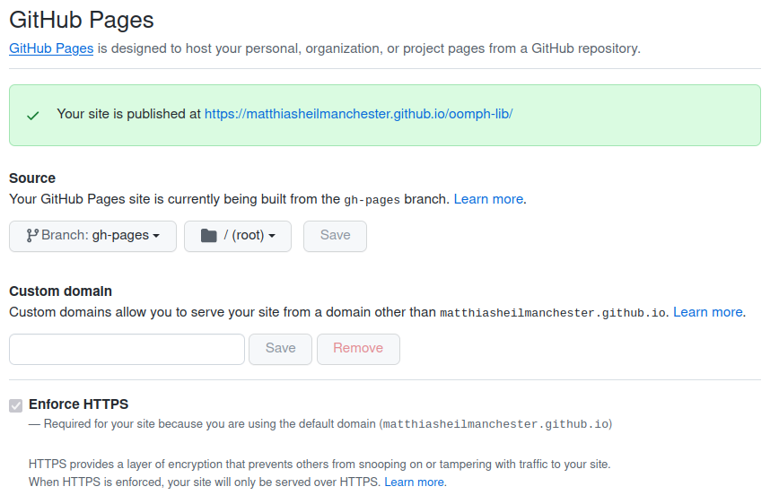

Make a note of the URL shown behind "Your site is published at" in the green box. This is where your local version of the webpages will be published. It is a good idea to add this to the "About" information on the GitHub page for your forked repository, so it looks like this:

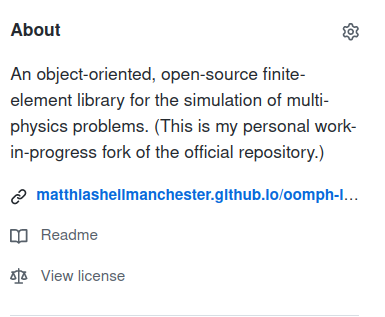

You can add this information by clicking on the settings for this page which opens this menu:


### Initiating the (re-)build of the webpages

To rebuild the webpages from some specified branch in your forked repository, click on the "Actions" tab and choose the "Documentation" workflow. 

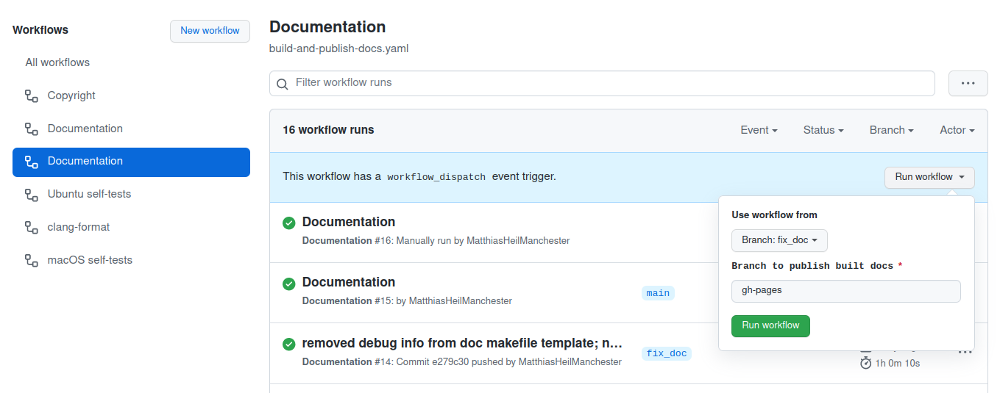

As you can see, this workflow can be triggered manually. If you click on the grey "Run workflow" button you get a drop-down menu that allows you to specify the branch from which you want to build the documentation (here the branch `fix_doc` has been selected; note that GitHub can (obviously!) only work with the version of the branch that has been pushed to the remote repository). Leave the second option unchanged (`gh-pages`) and then press the green "Run workflow" button. Once the Action has completed you'll be able to inspect the new set of webpages on the URL that you should have made a note of in the previous step. If it all looks OK, you can issue a pull request and point the reviewers to your webpages so they can inspect these pages themselves.

## Code review
Generally, pull requests should be of a "digestible" size so that any issues arising during a code review can be resolved within a few iterations. Interact with the code reviewer by whichever means is easiest for you, but use the "comments" feature on the GitHub webpages in the first instance so there's a record of the issues raised. Sometimes it'll be easier to follow up via zoom or face-to-face discussions but in any case, the discussion should ultimately be marked as resolved, and the changes made should be transparent. "All done" is fine; more detail is required if suggestions were (jointly) deemed to be inappropriate. No need to over-engineer any of this -- small pull requests can just be merged in. However, the workflow described below should be sufficiently robust to deal even with "monster" pull requests.

The general workflow for approving a pull request is as follows:

1. **Reviewer:** Go to the "Files changed" tab for the pull request

   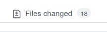

   and inspect the changes made.

 1. **Reviewer:** Add comments/requests for change by leaving a comment near the relevant part of the code. Hover over the line number until the blue plus sign appears

    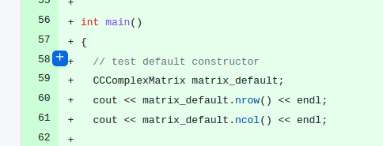

    Click on it to make the comments window appear. Describe the issue and if it's something that you feel *must* be resolved, press the green "Start a review" button. (If it's just a comment, use "Add single comment" instead.)
   
    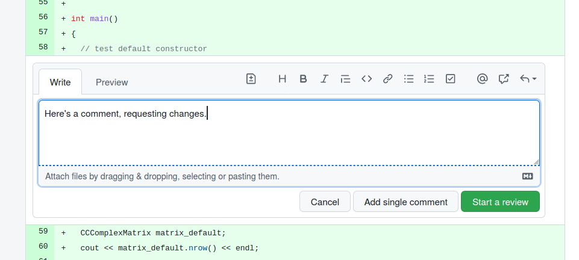
   
1. **Reviewer:** Keep going until you've reviewed all the changed files and left comments on all relevant issues, then finish the review by pressing the green "Finish your review" button at the very top of the page.

    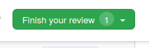

1. **Reviewer:** Add a brief overall summary of the issues raised in the window that appears:

   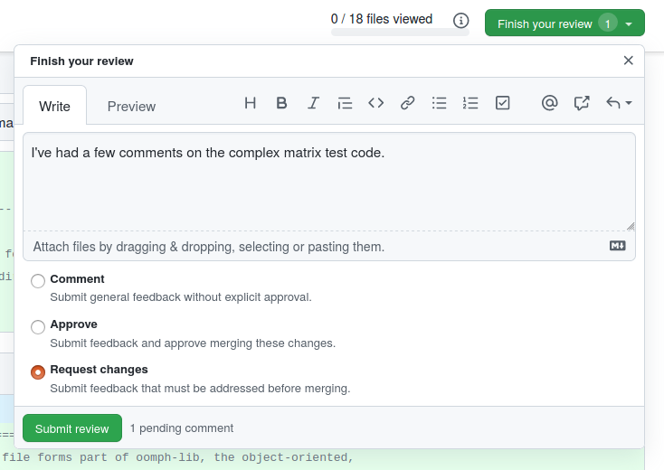

   If the changes are deemed essential, check the "Request changes" radio button before submitting the review.

1. **Reviewee:** Work your way through the comments and either change the code as suggested (do this in your local cloned version of your forked repository, in the same branch from which you originally submitted the pull request; then commit/push the changes to your remote forked repository; the changes will then automatically be included into the pull request), and leave a comment to say that you've done so. Alternatively, discuss/clarify the issue with the reviewer. 

1. **Reviewee:** When you believe the issue has been resolved to everybody's satisfaction (this may involve a few iterations), leave a final comment "Done" in the chain of comments, and let the reviewer know when you've dealt with all of them.

1. **Reviewer:** Revisit the issues. Sadly, there does not seem to be an easy way to do this; you'll have to scroll back through the conversation page to find any change requests that you made. They are marked with a red symbol:

   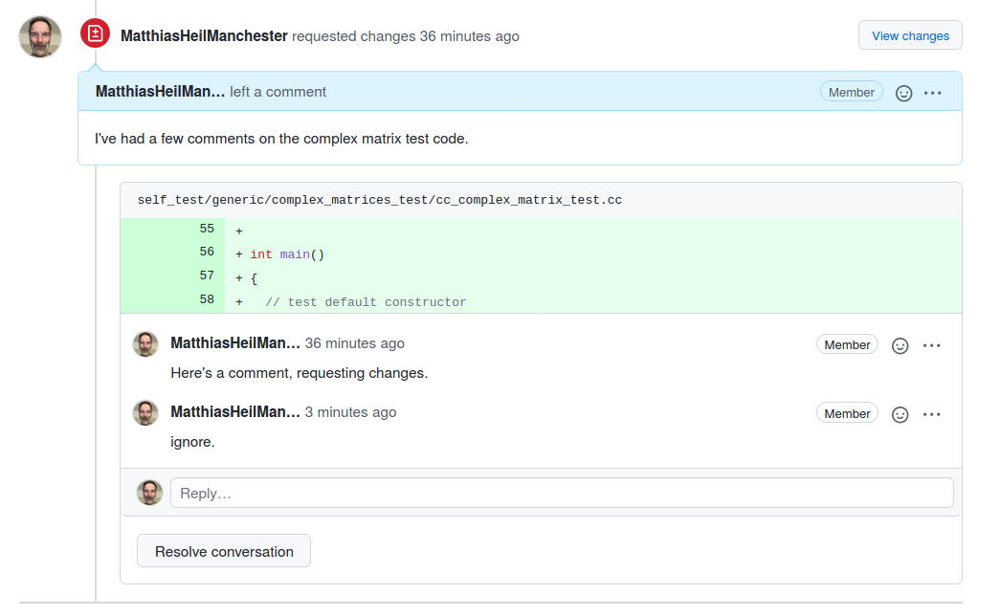

   Once you're happy with the changes made (or agree that the request wasn't sensible), press the "Resolve conversation" button. 

1. **Reviewer:** Once all the issues have been dealt with to your satisfaction, go to the bottom of the page and indicate that you approve the changes made as part of this pull request (click on the "..." next to your name):

   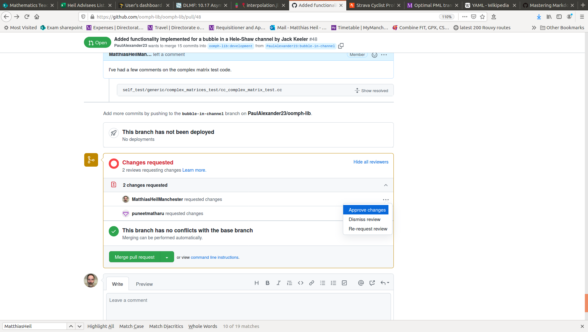

1. **Reviewer:** When all requests from all reviewers have been dealt with, and all reviewers have approved the changes, the changes can be merged in by pressing the green "Merge pull request" button. **IMPORTANT:** Before you merge, go to the top of the page and double-check that you're merging into the `development` branch rather than the `main` branch!

## Advanced: pulling in upstream changes from the command-line

Described below is an alternative way to pull changes from the official repository (`upstream`) into your local forked and remote forked repositories using the command-line.

1. Switch to the `development` branch
   ```bash
   >>> git checkout development
   ```

2. If you haven't done this already, add the upstream repository as a new remote repository named `upstream`
   ```bash
   >>> git remote add upstream git@github.com:oomph-lib/oomph-lib.git
   ```

3. Confirm that a remote named `upstream` has been added to your list of remotes
   ```bash
   >>> git remote -v
   origin	git@github.com:JoeCoolDummy/oomph-lib.git (fetch)
   origin	git@github.com:JoeCoolDummy/oomph-lib.git (push)
   upstream	git@github.com:oomph-lib/oomph-lib.git (fetch)
   upstream	git@github.com:oomph-lib/oomph-lib.git (push)
   ```
4. Fetch the upstream copy of the `development` branch and immediately merge it into your local copy
   ```bash
   >>> git pull upstream development
   ```

5. Resolve any merge conflicts you may have. Strictly speaking, you
   should only be using the `development` branch to stay in sync with the upstream repository i.e. you shouldn't be adding changes to it directly yourself, so there should never be any merge conflicts.

6. Now push the changes in your local forked repository up to your remote forked
   repository (`origin`)
   ```bash
   >>> git push origin development
   ```
   Now both your local forked repository and your remote forked repository are in
   sync with the upstream (i.e. official) repository. Hurray!


## Advanced: pulling in changes from another branch without going through the central repository

  Imagine that somebody has written a piece of code that you want to use, but they are not yet ready to create a pull request to the main `oomph-lib` development branch. Obviously, they could just send you the code, but the better way is to ask them to create a pull request to a branch on your forked copy of the repository. Ideally, you should create a new branch specifically to pull in the changes, but you could also pull into the development branch. You should follow the steps described in [Code review](#code-review) to pull those changes into your branch. You now have the problem that your upstream repository is different from the local copy on your machine, but you can solve this problem with the git merge command.

 1. Make sure that you fetch the upstream copy of repository that includes the changes pulled in
   from the external source. 
   ```bash
    >>> git pull upstream external-feature-branch
    ```

 2. Resolve any merge conflicts. If you have created a separate branch there should be no conflicts, but if you have pulled changes into an existing branch then there is potential for some conflicts.

 3. Use git checkout to switch to the branch into which you want to bring the changes
    ```bash
    >>> git checkout my-cool-feature
    ```

 4. Now use git merge to bring in the changes from the other branch
    ```bash
     >>> git merge external-feature-branch
    ```

 5. Resolve any merge conflicts.

 6. Carry on working as usual until you are ready to commit your changes to the branch.


## Clang-format
To ensure a consistent C++ code style throughout the `oomph-lib` library, we use
the [`clang-format`](https://clang.llvm.org/docs/ClangFormat.html) code formatter,
automated through the use of a GitHub Action. The [`.clang-format`](.clang-format)
file in the root directory provides the style specification for `clang-format` and
the [`.github/workflows/clang-format.yaml`](.github/workflows/clang-format.yaml)
GitHub Action applies the formatting. If you followed the steps in [Basic setup
(only to be done once)](#basic-setup-only-to-be-done-once), this Action will
automatically be enabled for you.

Whenever you push to a branch in your GitHub repository, the `clang-format`
GitHub Action will be triggered and run. (**Note:** this Action does exclude the
`main` branch and it assumes that you won't touch your `development` branch, but
it should be clear after reading this guide that you should never push to them
directly anyway!) After formatting your code it will create an extra commit
containing any changes that were made. If your code did not require any changes,
an additional commit will not be created.

To manually format specific files containing C++ code with `clang-format`, you
will need to pass their names to the `clang-format` command and also specify the
`-i` and `--style=file` flags. These flags specify that the formatting should be
performed "in-place" and using the style specification provided in the
`.clang-format` file (which should be located either in the current directory
or in one of its parent directories -- the "nearest one" is used), respectively. 
For example, to format two files named `file1.cc` and `file2.cc`, use the following:
```bash
>>> clang-format -i --style=file file1.cc file2.cc
```
Any number of files can be supplied to this command so if, instead, you
want to format all `.h` and `.cc` files in a folder, use the following:
```bash
>>> clang-format -i --style=file *.{h,cc}
```
Be warned, you should **not(!)** use the latter command in the `src/generic/` folder
or in the `demo_drivers/` folder; the `src/generic/` folder has files containing
C code that we purposely avoid formatting, and formatting the code in the
`demo_driver/` folder can break the documentation.

_For the above to work, you will need at least version 10.0.0 of `clang-format`._
## Pre-commit hooks (optional)

A pre-commit hook is something that automatically runs on your local computer
when you perform a commit. Pre-commit hooks can be useful for pointing out
issues in code, e.g. missing semi-colons, trailing whitespaces, or incorrect
formatting.

To manage our hooks, we use the [`pre-commit`](https://pre-commit.com/)
framework. If you're curious, you can find the specification for these hooks in
[`.pre-commit-config.yaml`](.pre-commit-config.yaml). The hooks will be run
automatically when you run `git commit` (i.e. at Step 4 of [The steps in
detail](#the-steps-in-detail)) and only the files that you have staged for the
commit will be affected. If any changes are made by one of these pre-commit
hooks, your commit will fail to complete, providing you with the opportunity to
correct the inadmissible changes.

At the moment, we currently only provide support to run `clang-format` as a
pre-commit hook. We allow this hook to perform "in-place" editing so when it
runs it will automatically format your code for you. If changes were made, the
commit will fail, as mentioned above. However, as the files are not formatted,
all you need to do is simply add the formatted files to the commit. When you
run `git commit` again, the pre-commit hook tests should pass and your commit
will complete.

_To use this hook, you will need at least version 10.0.0 of `clang-format`._

### Installing

Below are instructions on how to install and use the pre-commit hooks on Ubuntu
and macOS.

**Ubuntu**

First, make sure you have `pip` available. If you don't, run
```bash
>>> sudo apt-get install python3-pip
```
Once you have `pip`, you need to download [`pre-commit`](https://pre-commit.com/)
and install the hooks. To do this, run the following:
```bash
>>> pip install pre-commit
>>> pre-commit install
```

**macOS**

On macOS, you have a few different options for installation:

  1. **Use Homebrew:**

      If you have [Homebrew](https://brew.sh/) installed, all you need to do is run

      ```bash
      >>> brew install pre-commit
      >>> pre-commit install
      ```

   1. **Use MacPorts**:

      If instead you prefer to use [MacPorts](https://ports.macports.org/), run
      ```bash
      >>> sudo port install pre-commit
      >>> pre-commit install
      ```

   2. **Use `pip`:**

      Finally, if you do not wish to use either [Homebrew](https://brew.sh/) or
      [MacPorts](https://ports.macports.org/), you can use `pip`. To install `pip`,
      run
      ```bash
      >>> curl https://bootstrap.pypa.io/get-pip.py -o get-pip.py
      >>> python3 get-pip.py
      >>> rm -f get-pip.py
      ```
      then run
      ```bash
      >>> pip install pre-commit
      >>> pre-commit install
      ```
      to install the pre-commit hooks.

Done!

### Uninstalling

To uninstall the hooks, simply run
```bash
>>> pre-commit uninstall
```

### Remarks

If, for some reason, you are sure that you need to bypass the pre-commit hooks,
simply add the `--no-verify` flag when you run `git commit`:
```bash
>>> git commit --no-verify -m "...your message here..."
```

